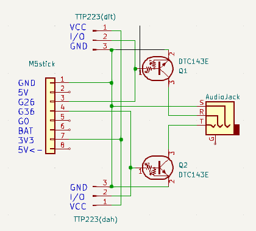
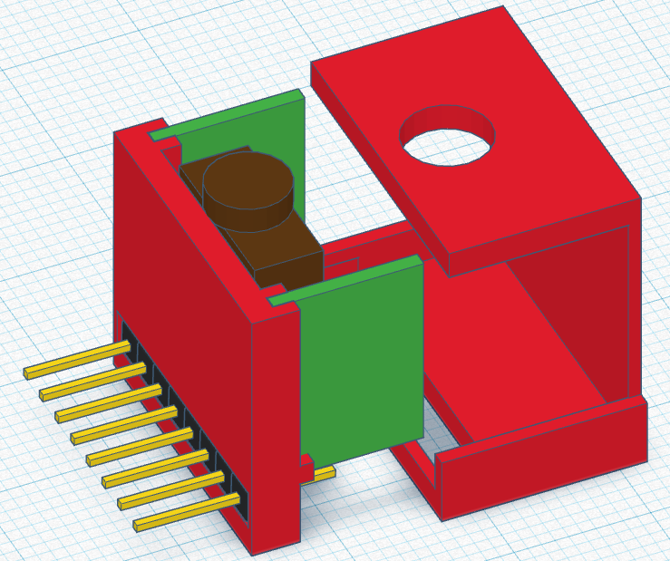

# Morse Code Trainer, Communicator, and CW Keyer for esp32 based M5StickC Plus

## Introduction

This project is a versatile Morse code trainer, communicator, and CW keyer designed for the M5StickC Plus device. It is inspired by the Morserino project, but with the goal of creating a much smaller, wrist-mounted device and is programmed from scratch as a programming exercise. The project features multiple modes for practicing, sending Morse code messages (https://vimeo.com/813324676), operating as a touch paddle and CW keyer(https://vimeo.com/813324676) and a bluetooth keyboard mode (https://vimeo.com/813661630). With a user-friendly interface and a custom-built add-on module with touch paddles and a 2.5mm plug for radio connection, this project is suitable for both beginners and experienced Morse code enthusiasts.

*Image of the M5StickC Plus device with custom-built add-on module*

## Features

- Touch keyer for practicing Morse code
- Custom add-on module with touch paddles and a 2.5mm plug for radio connection
- CW keyer mode for operating as a touch paddle and controlling a radio
- Bluetooth Low Energy (BLE) keyboard support for sending Morse code characters as keyboard input
- ESP-NOW communication for sending Morse code messages over Wi-Fi
- Koch method trainer for learning Morse code progressively
- Echo trainer for practicing Morse code by listening and repeating characters
- Intuitive menu navigation
- EEPROM data handling for storing user settings

## Usage

To use this project, follow these steps:

1. Clone or download the repository.
2. Choose the branch corresponding to your preferred development environment:
   - For Arduino IDE, switch to the `Arduino IDE` branch.
   - For PlatformIO, use the `master` branch.
3. Open the project in your preferred development environment.
4. Install the required libraries, such as M5StickCPlus, BLEKeyboard, and ESP-NOW.
5. Assemble the custom-built add-on module with touch paddles and a 2.5mm plug for radio connection.
6. Attach the add-on module to the M5StickC Plus device.
7. Upload the code to your M5StickC Plus device.
8. Navigate through the menu using the buttons on the device and select the desired mode.

## Bill of Material

| Item | Quantity |Source|
|------|----------|------|
| M5StickC Plus | 1 |https://amzn.eu/d/3ySDARb
| CONN HEADER VERT 10POS 2.54MM| 1 |https://amzn.eu/d/7BOjlZF|
| Enameled Copper Wire 0.4mm | 0.5m | https://amzn.eu/d/dhf6aA8 | 
| TTP223 Capacitive Touch Sensor Module | 2 |https://amzn.eu/d/hMWKoeN|
| DTC143E Digital Transistor| 2 |https://www.rs-online-privat.de/Products/ProductDetail/ROHM-DTC143EKAT146-SMD-NPN-Digitaler-Transistor-100-mA-SMD-3-Pin-2461671
| 3.5mm 5pin DIP PCB (e.g. from HALJIA) | 1 | https://amzn.eu/d/eXsqrqV |
| 3D printed Base part | 1 | [base](/cad/WristMorse_base.stl)|
| 3D printed Lid | 1 | [lid](/cad/WristMorse_lid.stl)|
| Superglue | some | you know were to get it |

## Wiring

## Assembly

1. 3d Printing of base and lid part. I used TinkerCad, feel free to modify: [link to tinkercad repository](https://www.tinkercad.com/things/aN4yCXyS5EN?sharecode=FDEHknXaCy3AVA37gZpHX5ytrah3ygyH9-0glm6WoO8)

2. Glue DTC143E Digital Transistor to TTP223 capacitive touch board. Pins shoud be close to the I/O and GND holes. They will be connected using solder, once wires are solderd. Double check for connections, should be bottom up.

3. Attach 3.5mm phone jack to 3d printed base.

4. Cut Pin header to 8 pins.

5. Prepare Copper Wire with lengths as indicatd in image, remove isolation at wire ends using sand paper and solder. Solder to pin header, as shown in diagram.

6. Solder wires to Touch Sensor boards, then use solder to cennect neighboring Transistor pins

7. Glue pin header to 3D printed base

8. Solder remaining pin of transistors to 3.5mm phone jack pins

9. Solder Ground wire to phone jack

10. Place lid. Lid does not fit well, currenlty.. Need to work on it

## To Do

- Improve the user interface for better user experience
- Add more training modes and exercises for Morse code practice
- Implement additional wireless communication protocols
- Optimize power consumption for longer battery life
- Enhance touch paddle responsiveness and customization
- Add support for external displays and accessories
- Improve documentation and provide detailed user guides
- Simplify build by using M5 proto board
## Contributing

We welcome contributions to this project. If you have suggestions, bug reports, or want to contribute code, feel free to open an issue or create a pull request.

## License

This project is licensed under the MIT License. See the `LICENSE` file for more details.
