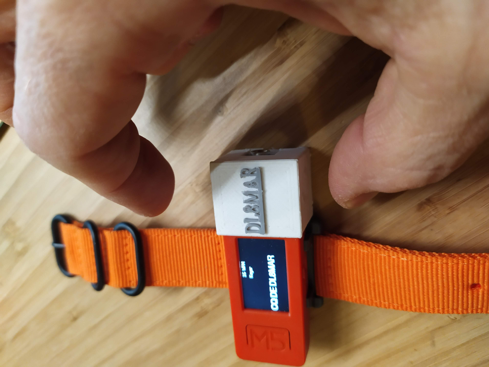
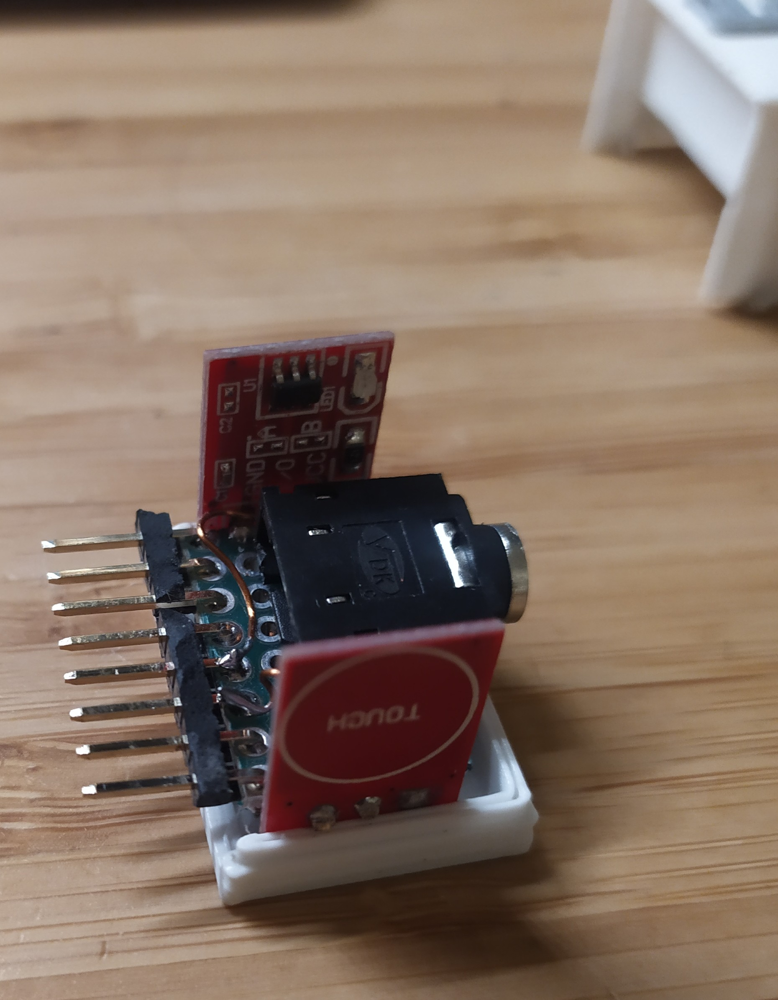
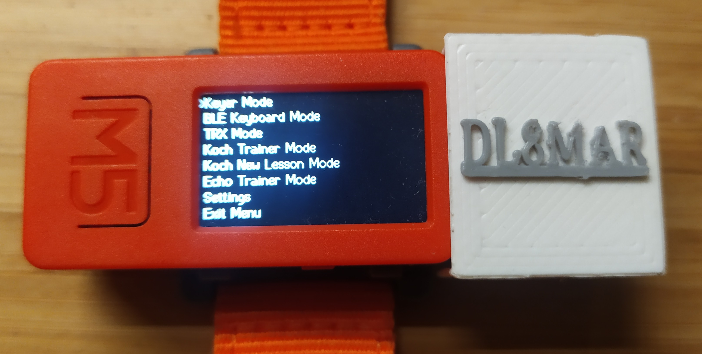

# Morse Code Trainer, Communicator, and CW Keyer for esp32 based M5StickC Plus

## Introduction

This project is a versatile Morse code trainer, communicator, and CW keyer designed for the M5StickC Plus device. It is inspired by the Morserino project, but with the goal of creating a much smaller, wrist-mounted device and is programmed from scratch as a programming exercise. The project features multiple modes for practicing, sending Morse code messages (https://vimeo.com/813324676), and operating as a touch paddle and CW keyer(https://vimeo.com/813324676). With a user-friendly interface and a custom-built add-on module with touch paddles and a 2.5mm plug for radio connection, this project is suitable for both beginners and experienced Morse code enthusiasts.

*Image of the M5StickC Plus device with custom-built add-on module*

## Features

- Touch keyer for practicing Morse code
- Custom add-on module with touch paddles and a 2.5mm plug for radio connection
- CW keyer mode for operating as a touch paddle and controlling a radio
- Bluetooth Low Energy (BLE) keyboard support for sending Morse code characters as keyboard input
- ESP-NOW communication for sending Morse code messages over Wi-Fi
- Koch method trainer for learning Morse code progressively
- Echo trainer for practicing Morse code by listening and repeating characters
- Intuitive menu navigation
- EEPROM data handling for storing user settings

## Usage

To use this project, follow these steps:

1. Clone or download the repository.
2. Choose the branch corresponding to your preferred development environment:
   - For Arduino IDE, switch to the `Arduino IDE` branch.
   - For PlatformIO, use the `master` branch.
3. Open the project in your preferred development environment.
4. Install the required libraries, such as M5StickCPlus, BLEKeyboard, and ESP-NOW.
5. Assemble the custom-built add-on module with touch paddles and a 2.5mm plug for radio connection.
6. Attach the add-on module to the M5StickC Plus device.
7. Upload the code to your M5StickC Plus device.
8. Navigate through the menu using the buttons on the device and select the desired mode.

## To Do

- Improve the user interface for better user experience
- Add more training modes and exercises for Morse code practice
- Implement additional wireless communication protocols
- Optimize power consumption for longer battery life
- Enhance touch paddle responsiveness and customization
- Add support for external displays and accessories
- Improve documentation and provide detailed user guides
- Simplify build by using M5 proto board
## Contributing

We welcome contributions to this project. If you have suggestions, bug reports, or want to contribute code, feel free to open an issue or create a pull request.

## License

This project is licensed under the MIT License. See the `LICENSE` file for more details.
